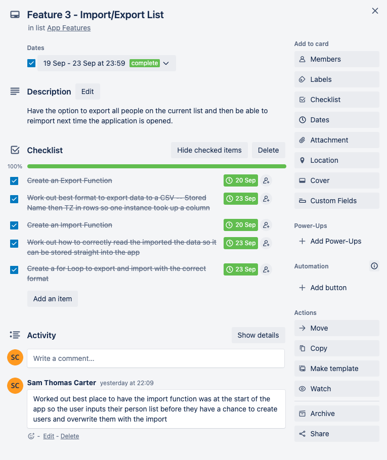

# Timezoco 

## [Github Link](https://github.com/s-carter91/T1A3_Terminal_Application/tree/master)

### Styling Guides

#### PEP-8 - Style Guide for Python Code [PEP-8 Link](https://peps.python.org/pep-0008/#naming-conventions)

#### Imports
With library imports, I have imported specific methods from the library where possible  
Also listed in the correct order as per the documentation (1: Standard library imports 2: Related third party imports 3: Local application/library specific imports)

#### Maximum Line Length
No single line of code is longer than the 99 characters that PEP8 states as a maximum character per line limit (except if Docstring or Comment which have a maximum line length of 72 characters).

#### General PEP8 Formatting
Double blank lines have been added around top level functions and classes.

#### PEP-257 - Docstring Conventions [PEP-257 Link](https://peps.python.org/pep-0257/)

##### One-line and Multi-line Docstrings

Docstrings have been added to all functions and formatted correctly based on if they are single or multi-line as per PEP-257.

### Features

#### Feature 1 - Creating People Objects

The first feature of the application allows the end user to create and store a person within the application. When the user selects "add a new person" a class constructor is called and an instance created based off the name input (string) and a timezone (pick from a list which was imported with the pytz library). From here they may also change the time zone of a stored person or delete the person. A while loop is used when adding a person and the user will be in that loop until they select "no" (from a list) when asked if that want to add another person.  

Error Handling – A custom error exception was created for duplicate or empty name inputs when the class constructor is called. The user is advised of the exact issue and asked to input the name again.

##### Feature 2 - Displaying Current Time of Stored People

The second feature allows the end user to display the current times of the people who were stored using the first or third feature. The user will have two options within this feature for how they want to display users. They can either select a person from a menu list they want to view the current time for or display all of the people objects that have been stored. A while loop (with the condition of while the return to main menu option isn't selected) was used when selecting between the two options or returning to the main menu. Once an option has been selected, a function will be called. Displaying all users on the list did require a for loop as all Person instances were retrieved and name/time zone values were displayed. The time_convert function, which converts a persons time to a set time format is also run on the time zone value when the display functions are called and executed.  

Error Handling – Error exceptions have been setup in feature two to check if there are class instances in the list before attepmpting to convert and display them. This has been set up for both options (view individual and view full list)

##### Feature 3 - Import and Export of Stored People

The third feature provides a way for the user to import the stored list via a CSV file or export the current stored list to a CSV file. When the user starts the applcation, they will be asked if they want to import a file of people (advised to tick no if it's the first time running the app). This is treated similar to a save file which is stored locally. The user can export their list of people using the export option from the main menu. A for loop is used both when importing and exporting to separate the class instances and input from/output to the CSV file in the correct and app readable format.  

Error Handling - When importing files, the time zone data is checked to confirm it has a corresponding time zone in the pytz database by the same name. If an error is found, the user will be made aware of the failed import and the app will continue importing the other people from the CSV

### Implemtnatation Plan

The implementation plan was created through Trello. It appears to be a very popular tool for good reason. The lists created in Trello were:

* Rubric Requirements - Reminders of what need to be included in the code/documentation.
* Documentation - More indept list of what should be included in the documentation.
* Presentation - What needs to be prepared for the presentation.
* App Features - The golden stuff of the Trello board. Breaks each feature down into steps that can be checked off.
* Optional Additions - These were "if-there-was-time" additions.
* Other Items - Other items that were needed but didn't quite fit under the other headings

